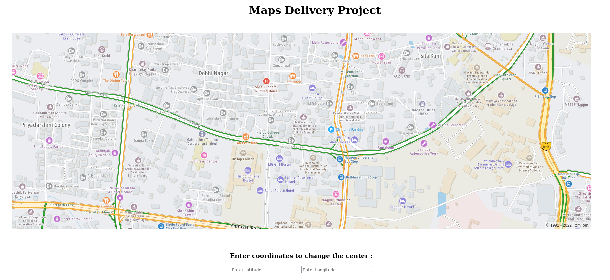
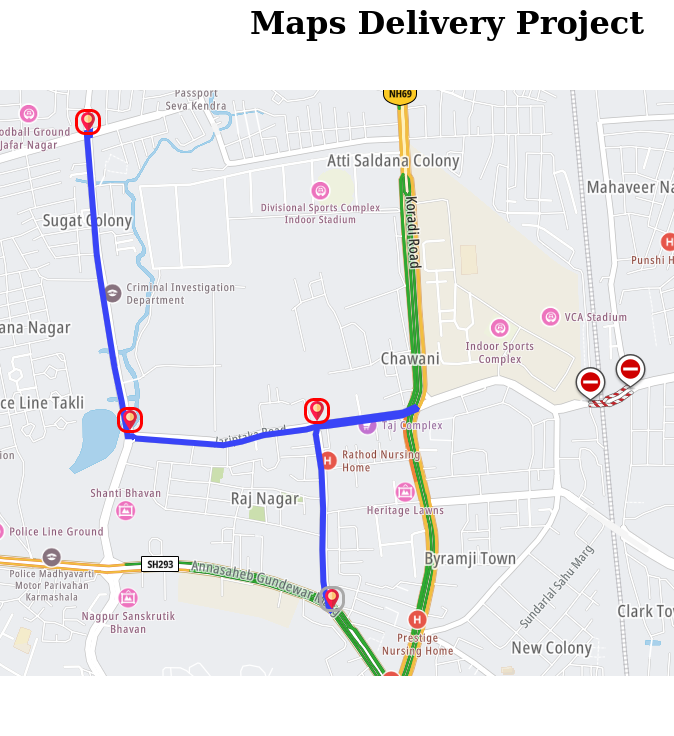

# Quick-Delivery

This Web Application helps in Calculating the Shortest Route for Delivery of Logistics at multiple locations using Matrix Routing API which takes into account the vehicle type, live traffic flow, and incidents on the road.

### Tech Stack Used

### Screenshots

The Initial Map and Marker to Drag and Set Origin Location

Next step is to point delivery locations and the best route wil be automatically marked

